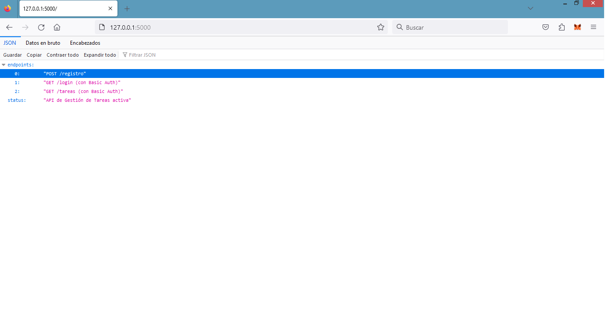
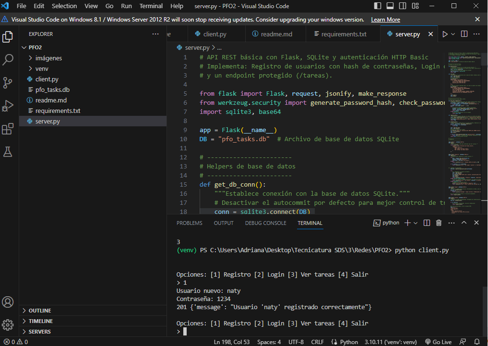
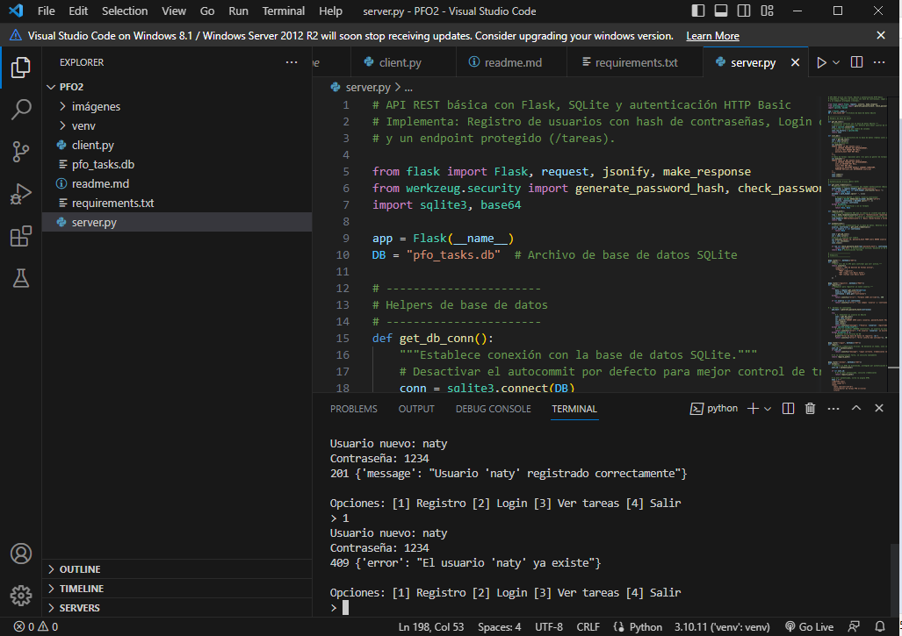
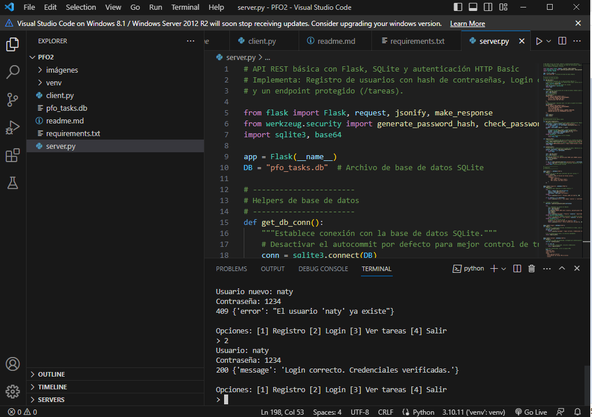
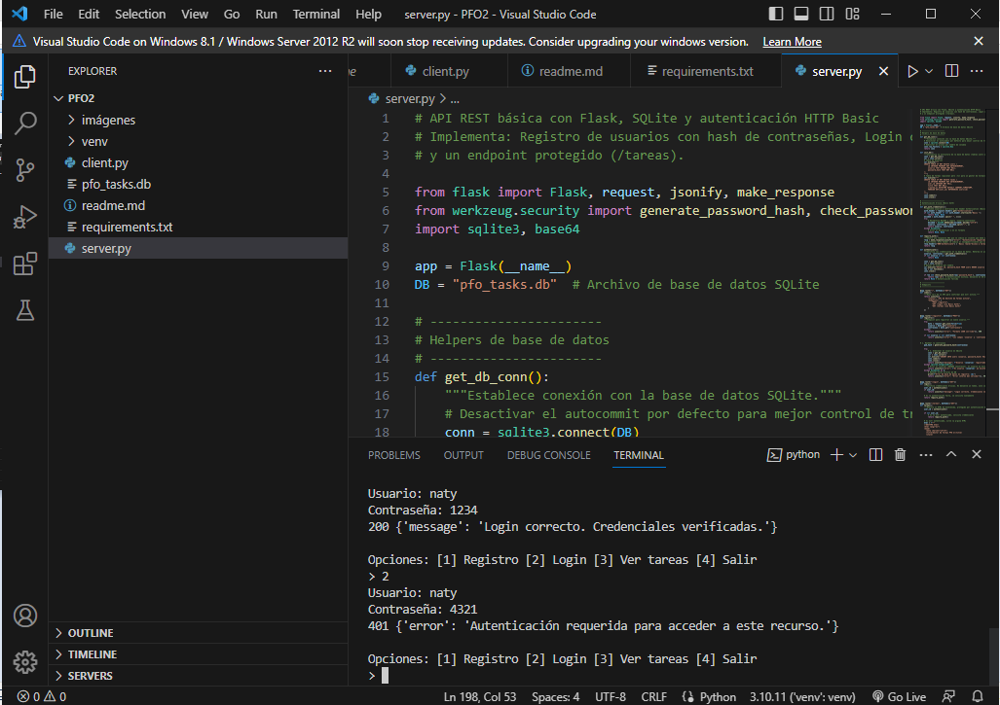
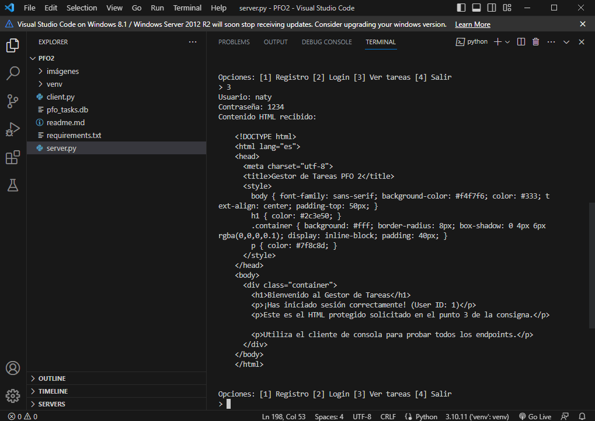
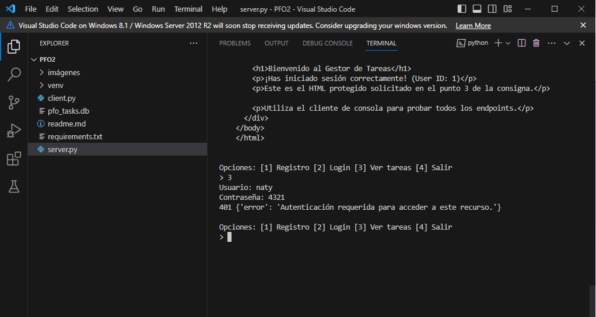

# 📡 PFO 2: Sistema de Gestión de Tareas con API y Base de Datos

Este proyecto implementa una API REST básica utilizando Flask para el servidor, SQLite para la persistencia de datos y HTTP Basic Authentication para proteger los endpoints.

Incluye un cliente en consola para interactuar con la API sin necesidad de Postman o navegador.

---

## Estructura del proyecto

PFO2_Redes/

├── server.py        # Servidor API Flask

├── client.py        # Cliente en consola

├── requirements.txt # Dependencias del proyecto

├── imágenes/        # Carpeta con screenshots de pruebas

│   ├── api_en_linea.png

│   ├── login_exitoso.png

│   ├── login_contraseña_incorrecta.png

│   ├── registro_exitoso.png

│   ├── registro_usuario_ya_existe.png

│   ├── tareas_bienvenida.png

│   └── tareas_contraseña_incorrecta.png

└── README.md        # Documentación y respuestas a consignas teóricas

### API funcionando correctamente

### Registro de Usuario

### Registro de usuario ya existente

### Inicio de Sesión Correcto

### Inicio de Sesión Fallido

### Acceso a Tareas

### No accede a tareas por contraseña incorrecta

## 🚀 Instrucciones para Ejecutar el Proyecto

### 📦 Requisitos
Se necesita tener instalado Python 3.x y las siguientes librerías:

- Flask
- requests
- werkzeug (para hasheo de contraseñas)

Instalación rápida de dependencias:

`bash`
`pip install -r requirements.txt`

#### Instrucciones para Ejecutar el Proyecto y Probarlo
Clonar el Repositorio
Para obtener el código fuente y comenzar a trabajar, usa el siguiente comando en tu terminal:

`git clone https://github.com/Itan87/PFO2_Redes`
`cd TU_NOMBRE_DEL_DIRECTORIO` 

##### ▶️ Pasos para la Ejecución
Iniciar el servidor (API)
Abrir la Terminal 1 y ejecutar:
`python server.py` 

La primera vez que se ejecute, se creará la base de datos pfo_tasks.db.

Iniciar el cliente
Abrir Terminal 2 y ejecutar:
`python client.py` 
Probar Endpoints (opcional)

###### ✅ Pruebas de endpoints

| Opción | Endpoint       | Objetivo                   | Credenciales           | Resultado esperado |
|--------|---------------|---------------------------|----------------------|------------------|
| 1      | POST /registro | Crear un nuevo usuario     | usuario: ana / pass: 1234 | 201 – Usuario registrado correctamente |
| 1      | POST /registro | Usuario ya existente       | usuario: ana / pass: 1234 | 409 – Usuario ya existe |
| 2      | GET /login     | Login correcto            | usuario: ana / pass: 1234 | 200 – Login correcto |
| 2      | GET /login     | Login incorrecto          | usuario: ana / pass: 4321 | 401 – Login incorrecto |
| 3      | GET /tareas    | Acceso con login válido   | usuario: ana / pass: 1234 | 200 – HTML de bienvenida |
| 3      | GET /tareas    | Acceso con password mala  | usuario: ana / pass: 4321 | 401 – Autenticación requerida |

## 🧠 2. Respuestas conceptuales

🔒 ¿Por qué hashear contraseñas?
Hashear contraseñas es fundamental para **proteger la seguridad de los usuarios**. Se utiliza para generar una cadena de texto de longitud fija (el hash) a partir de la contraseña original, mediante un algoritmo matemático que es fácil de calcular, pero extremadamente difícil de revertir (unidireccional).
Así, convierte la contraseña en una cadena irreconocible de modo que si un atacante obtiene la base de datos, no puede ver las contraseñas en texto plano.
**Protección en caso de brecha**: Si roban la base de datos, verán hashes como pbkdf2:sha256:..., no las contraseñas reales.
**Verificación segura**: En el login, el sistema hashea la contraseña ingresada y compara hashes, nunca la contraseña en crudo.

💾 Ventajas de usar SQLite
SQLite es una base de datos ligera y simple que ofrece ventajas específicas para este tipo de proyectos académicos o POC (Prueba de Concepto):

**Configuración cero(Serverless)**: SQLite no requiere un proceso de servidor separado. La base de datos se almacena como un único archivo (pfo_tasks.db), lo que elimina la necesidad de instalar, configurar y administrar un sistema gestor de bases de datos complejo (como MySQL o PostgreSQL).
**Portabilidad**: Los datos se guardan en un solo archivo (pfo_tasks.db) que podés mover entre entornos. Es ideal para el desarrollo local y para aplicaciones sencillas.
**Integración nativa con Python**: El módulo sqlite3 está incluido en la biblioteca estándar de Python, lo que permite una integración directa y sin necesidad de instalar controladores adicionales, simplificando el código de conexión.

👩‍💻 Autor - Natalia Nuñez
Trabajo práctico realizado para Programación sobre Redes – Tecnicatura en Desarrollo de Software (3er año).

